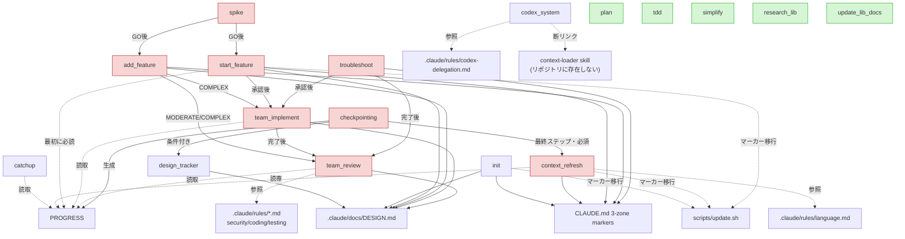

# Skill 独立性 (自己完結性) 監査レポート

_対象: `.claude/skills/<name>/SKILL.md` — 実在するスキルディレクトリは **17個**（タスク指示は「18」だが、実ディレクトリ数は17。差分はフラグとして記録）。_
_性質: READ-ONLY 分析。スキルファイルは一切変更していない。_

「独立性 (independence)」= そのスキルを単独でコピー配布しても暗黙的に壊れないか。
他スキル呼び出し・共有ファイル参照・外部ツール依存が多いほど独立度は低い。

---

## 1. 依存マップ表

| skill名 | 依存先skill (ハンドオフ/呼び出し) | 共有ファイル依存 | 外部ツール依存 | 自己完結バンドル | 独立度 |
|---|---|---|---|---|---|
| **plan** | なし | なし | なし（`$ARGUMENTS`のみ） | なし | **高** |
| **tdd** | なし | なし | uv/pytest コマンド（devenv） | なし | **高** |
| **simplify** | なし | `.claude/docs/libraries/`（任意, L30） | uv/pytest | なし | **高** |
| **research-lib** | なし | 出力先 `.claude/docs/libraries/`（規約） | general-purpose subagent＋WebSearch/WebFetch（fallback有 L30） | なし | **高** |
| **update-lib-docs** | なし | `.claude/docs/libraries/`（対象） | WebSearch（暗黙） | なし | **高** |
| **design-tracker** | なし（他から呼ばれる側） | `.claude/docs/DESIGN.md`（中核, 固定見出し）, `PROGRESS.md`（言及） | なし | なし | **中** |
| **codex-system** | なし（※`context-loader` skillへの断リンク L217） | `.claude/rules/codex-delegation.md`（L19） | **codex CLI（中核）**, codex-plugin-cc（任意） | **references/*.md（5本）※SKILL.mdから未リンクの孤立資産** | **中** |
| **catchup** | 助言的参照: `/start-feature`,`/add-feature`,`/spike`,`/troubleshoot`,`/checkpointing`,`/design-tracker`（L26-28,210-213） | README, CLAUDE.md, AGENTS.md, `.claude/rules/*`, `.claude/skills/*`, `.claude/agents/*`, DESIGN.md, research/, libraries/, `.claude/checkpoints/`, `.claude/logs/`, PROGRESS.md, pyproject.toml → 出力 `GUIDE.md` | general-purpose subagent, git | なし | **中**（全て任意読取・"not present"で優雅に劣化） |
| **init** | なし | CLAUDE.md Zone B＋境界マーカー（中核）, DESIGN.md（生成）, AGENTS.md, `scripts/update.sh`（L35,97）, `.claude/rules/`（L146） | AskUserQuestion | なし | **中**（テンプレ固有・低寄り） |
| **add-feature** | `/team-review`,`/team-implement`（実装ルート L28-30,381-402）, `/start-feature`,`/troubleshoot`（比較 L37-39） | `.claude/docs/research/`（L105）, DESIGN.md（L270）, CLAUDE.md（L404-431） | **codex exec（全Phase必須）**, general-purpose subagent（L83）, uv | なし | **低** |
| **spike** | 次工程ハンドオフ: `/add-feature`,`/start-feature`,`/team-implement`,`/troubleshoot`,`/team-review`（L9,27-50,435,500,549） | `.claude/docs/research/`, `.claude/spikes/`, `.claude/logs/agent-teams/` | **codex exec（全Phase必須）**, **Agent Teams**, subagent/WebSearch | なし | **低** |
| **start-feature** | `/team-implement`,`/team-review`（後続チェーン L23-29,336-343,363） | **PROGRESS.md（最初に必読 L52）**, research/, libraries/, DESIGN.md, CLAUDE.md Zone C＋マーカー＋`scripts/update.sh`（L287-289）, `.claude/logs/agent-teams/` | **codex exec**, **Agent Teams**, subagent | **references/task-patterns.md**（L283） | **低** |
| **team-implement** | `/start-feature`（前提 L6,13-31）, `/team-review`（後続 L259） | CLAUDE.md Zone C, DESIGN.md, research/, libraries/, PROGRESS.md, `.claude/logs/agent-teams/` | **Agent Teams**, codex（issue時）, **hooks(TeammateIdle/TaskCompleted)**, uv/poe | なし | **低** |
| **team-review** | `/start-feature`,`/team-implement`（入力継続 L19,31） | **`.claude/rules/security.md`(L95), `coding-principles.md`(L131), `testing.md`(L189)**, DESIGN.md(L28), PROGRESS.md(L30), libraries/(L137), research/（出力）, `.claude/logs/agent-teams/` | **Agent Teams**, codex exec（Quality Reviewer L140）, git | なし | **低** |
| **troubleshoot** | `/team-implement`,`/team-review`（後続 L9,27-29,575-576,602-603） | research/（複数）, CLAUDE.md Zone C（L508-536）, `.claude/logs/agent-teams/` | **codex exec（全Phase必須）**, **Agent Teams**, subagent | **references/debug-patterns.md**（L499） | **低** |
| **checkpointing** | **context-refresh（最終ステップで必ず呼ぶ L48,308,358）**, **design-tracker（条件付き呼出 L45,301,354）**, データ源: `/start-feature`,`/team-implement`,`/team-review` | **checkpoint.py がハードコード**: PROGRESS.md, CLAUDE.md Zone C, DESIGN.md（読）, `.claude/checkpoints/`, `.claude/logs/`, `~/.claude/teams`,`~/.claude/tasks` | python, subagent（パターン発見） | **checkpoint.py（中核ロジックを同梱＝良い自己完結）** | **低** |
| **context-refresh** | `/checkpointing`（呼ばれる側・所有境界）, 関連: `/start-feature`,`/add-feature`,`/troubleshoot`,`/init`,`/catchup`,`/design-tracker`（相互作用表 L267-275） | **CLAUDE.md Zone C＋境界マーカー（中核）**, PROGRESS.md（読専）, `.claude/checkpoints/`, research/＋archive, `scripts/update.sh`（L59）, `.claude/rules/language.md`（L263） | general-purpose subagent, AskUserQuestion | なし | **低** |

---

## 2. Mermaid 依存図

---

## 3. クラスタ分析

### クラスタA: Feature/Dev ライフサイクル（最大・最も密結合）
`spike → (add-feature | start-feature) → team-implement → team-review`、および `troubleshoot → team-implement → team-review`。
- **ハブノード**: `team-implement` と `team-review`（複数スキルの共通の後続工程）、`start-feature`（計画フェーズの中心）。
- 共通基盤: **codex CLI**、**Agent Teams ランタイム**、`.claude/docs/{research,libraries,DESIGN.md}`、`.claude/logs/agent-teams/`、CLAUDE.md Zone C。
- `spike`・`catchup` の他スキル参照は「次に何を使うか」の**助言的ハンドオフ**（ハード呼び出しではない）だが、`start-feature/team-implement/team-review` は**入力・命名継続の前提**で強く連鎖する。

### クラスタB: セッション記憶（所有境界で結合）
`checkpointing → context-refresh（必須）＋ design-tracker（条件付き）`。`catchup`・`start-feature` などが `PROGRESS.md`／`.claude/checkpoints/` を読む。
- `checkpointing` が PROGRESS.md/checkpoints の**唯一のオーナー**、`context-refresh` は CLAUDE.md Zone C のオーナー。責務分割が厳密で、CLAUDE.md の3ゾーン構造・境界マーカーに強依存。

### クラスタC: Codex（概念的ハブ／ファイル結合は弱い）
`codex-system` は codex CLI 運用の解説。多くの "Codex-first" スキル（add-feature/spike/troubleshoot/start-feature/team-review）が概念的に依拠するが、**SKILL.md 間の直接リンクは無い**。`.claude/rules/codex-delegation.md` に依存。

### スタンドアロン（他に依存されず・依存もしない）
`plan` / `tdd` / `simplify` / `research-lib` / `update-lib-docs` — 汎用スキル。単独配布で最も安全。
準スタンドアロン: `design-tracker`（DESIGN.md 1本のみ）、`init`（テンプレ固有だが他スキルを呼ばない）。

---

## 4. 独立度が「低い」skill の要因（具体的な外部参照）

- **add-feature**: 実装を `/team-review`,`/team-implement` に委譲（SKILL.md:28-30, 381-402）。codex exec 全Phase必須。DESIGN.md 更新（:270）、CLAUDE.md 更新（:404-431）。→ 単独では実装フェーズが空洞化。
- **spike**: 次工程を `/add-feature`,`/start-feature` に丸投げ（:9,435,500,549）。codex exec 全Phase必須＋Agent Teams（:161-377）。`.claude/spikes/`,`.claude/logs/agent-teams/`。
- **start-feature**: 冒頭で **PROGRESS.md 必読**（:52）、CLAUDE.md Zone C＋`scripts/update.sh`（:287-289）、DESIGN.md（:270相当）、後続 `/team-implement`,`/team-review`（:23-29）。Agent Teams＋codex。
- **team-implement**: 前提が `/start-feature` の成果物（:6,13,17,24,31）、後続 `/team-review`（:259）。Agent Teams＋**hooks(TeammateIdle/TaskCompleted)**（:219）。DESIGN.md/libraries/research/PROGRESS を読む（:26-30,110-116）。
- **team-review**: レビュアが **`.claude/rules/security.md`(:95)・`coding-principles.md`(:131)・`testing.md`(:189)** を明示参照。DESIGN.md(:28)・PROGRESS.md(:30)・libraries(:137)。Agent Teams＋codex(:140)。
- **troubleshoot**: 後続 `/team-implement`,`/team-review`（:9,27-29,575-576）。codex exec 全Phase必須（:103-483）。Agent Teams。CLAUDE.md 更新（:508-536）。
- **checkpointing**: **context-refresh を必ず呼ぶ**（:48,308,358）＋**design-tracker を条件付きで呼ぶ**（:45,301,354）。`checkpoint.py` が PROGRESS.md/CLAUDE.md/DESIGN.md/`.claude/checkpoints/`/`.claude/logs/`/`~/.claude/teams`,`~/.claude/tasks` をハードコード（checkpoint.py:25-35）。
- **context-refresh**: CLAUDE.md **境界マーカー(@orchestra:template-boundary / repo-boundary)** 必須（:59,236,255-262）、`scripts/update.sh`（:59）、`.claude/rules/language.md`（:263）、PROGRESS.md/checkpoints を読専扱い（:30-31）。`/checkpointing` に呼ばれる前提の設計。

---

## 5. 配布時の注意点（隠れた依存 — 一緒に運ぶ必要のある共有ファイル）

配布者が「スキルだけ」を切り出すと**サイレントに壊れる**。以下は同梱必須の隠れ依存：

### CLAUDE.md 3-zone マーカー
`@orchestra:template-boundary` / `@orchestra:repo-boundary` の2マーカーが無いと **init / context-refresh / start-feature / add-feature / troubleshoot** が停止（マーカー欠如時は `scripts/update.sh` 実行を要求）。
→ **CLAUDE.md（マーカー付き）と `scripts/update.sh` はセット必須。**

### `.claude/rules/*.md`
- `security.md` / `coding-principles.md` / `testing.md` → **team-review** のレビュア基準（欠けると参照切れ）。
- `codex-delegation.md` → **codex-system** の詳細ルール。
- `language.md` → **context-refresh** の最終レポート言語規約。

### `.claude/docs/DESIGN.md`（要件定義書テンプレ）
固定見出し（機能要件/非機能要件/アーキテクチャ/技術選定/制約/Key Decisions）前提。**init / design-tracker / checkpointing / start-feature / add-feature / team-implement / team-review / catchup** が読み書き。

### `PROGRESS.md`（ルート）
**checkpointing がオーナー・生成**。**start-feature / team-implement / team-review / context-refresh / catchup** が読む。git 追跡される「携帯可能な要約」。

### `.claude/docs/{research,libraries}/` と `.claude/spikes/`, `.claude/logs/agent-teams/`
成果物・作業ログの共有規約ディレクトリ。Agent Teams系スキルと checkpointing の収集ロジックが前提。

### 実行基盤（ファイルではないが必須）
- **codex CLI ＋ `CODEX_MODEL` 環境変数** — add-feature/spike/troubleshoot/start-feature/team-review/codex-system の中核。
- **Agent Teams ランタイム** — `~/.claude/teams`, `~/.claude/tasks`、および **hooks（TeammateIdle / TaskCompleted）** — spike/troubleshoot/start-feature/team-implement/team-review。
- **general-purpose subagent (Opus)** — 多数（catchup/context-refresh/research-lib 等）。research-lib は fallback あり。
- **codex-plugin-cc プラグイン**（任意）— codex-system のスラッシュコマンド群。

### checkpoint.py のパス前提
`PROJECT_ROOT = Path(__file__).parent.parent.parent.parent`（checkpoint.py:25）で **リポジトリ直下4階層** を仮定。`.claude/skills/checkpointing/` 以外に置くとパスが壊れる。

### 注意すべき不整合（配布前に要修正候補）
- **codex-system SKILL.md:217** が存在しない `context-loader` skill を参照（**断リンク**）。
- **codex-system/references/*.md（5本）** は同梱されているが **SKILL.md から一切リンクされていない孤立資産**（バンドルはされているが導線なし）。
- 実スキルディレクトリ数は **17**（タスク前提の「18」と不一致）。

---

## 6. 追加軸: コード化余地 (Code-ification opportunity)

各 SKILL.md 本文を「決定的・機械的手順（スクリプト化可能）」と「LLM判断が本質的な手順（プロンプトとして残す）」に分類する。
目的は **手順のコード化・ルール化によるスキル独立性の向上**。機械的手順をそのスキルディレクトリ内のスクリプトへ同梱すれば、md は「このスクリプトを実行する」の一文で済み、外部共有ファイルへの参照や表現ゆらぎが減って再現性が上がる。

### 6.1 コード化余地マップ

| skill | コード化できる機械的手順（具体） | バンドル推奨スクリプト案（ファイル名 + 役割） | md側を"実行する"に置換可能か |
|---|---|---|---|
| **checkpointing** | 既に大半コード化済（git/CLI/Teams集計, PROGRESS.md ローテーション, Zone-Cリンク挿入, sidecar出力） | ✅ `checkpoint.py`（同梱済） | **可**（現状ほぼ達成。残る散文は手順解説） |
| **context-refresh** | 境界マーカー存在チェック, `wc -l` 前後比較, マーカー再grep検証(=1), archiveディレクトリ`mkdir -p`, research移動 | `refresh_guard.py`（マーカー検証+行数レポート+移動プラン算出、dry-run JSON出力） | **一部**（検証・移動は可／Zone C要約・archive判断はLLM） |
| **init** | tech stack検出（package.json/pyproject.toml/Cargo.toml/go.mod走査）, マーカー存在チェック, commands抽出 | `detect_stack.py`（スタック+コマンドをJSONで返す）, `check_markers.sh` | **一部**（検出は可／DESIGN.md本文・要件整理はLLM＋AskUserQuestion） |
| **catchup** | git log/branch/status/stash 収集, `.claude/rules|skills|agents` のfrontmatter列挙, checkpoints/logs集計 | `collect_repo_state.py`（全ソースを構造化JSONで出力） | **一部**（収集は可／GUIDE.md統合・要約はLLM） |
| **team-review** | `git diff main...HEAD`（+`--name-only`, `git log`）, `pytest --cov`, `ruff check` の定型列 | `gather_diff.sh`（diff+変更ファイル+coverage収集） | **一部**（diff/coverage収集は可／セキュリティ・品質判断はLLM） |
| **team-implement** | 統合検証コマンド列（ruff/ruff format/ty/pytest = `poe all`） | `verify.sh`（品質ゲート一括実行+PASS/FAIL集計）※`poe all`で代替可 | **一部**（検証は可／チーム分割・監視・調整はLLM） |
| **troubleshoot** | エラー再現コマンド実行, `git log -20`/`git blame`/`git bisect` 定型, full test suite実行 | `repro.sh`（再現+スタックトレース捕捉+関連git履歴収集） | **一部**（再現・履歴収集は可／根本原因・仮説評価はLLM+Codex） |
| **spike** | prototype配置`.claude/spikes/{topic}/`作成, research出力パス生成, 成果物存在チェック | `spike_scaffold.sh`（ディレクトリ/出力パス雛形生成） | **一部**（scaffoldは可／実質はCodex+Agent Teamsの判断） |
| **add-feature** | 実装後の検証コマンド列（pytest/ruff/ruff format） | `verify.sh`（team-implementと共通化可） | **一部**（検証のみ／スコープ・設計はCodex判断） |
| **start-feature** | PROGRESS.md存在チェック+読込, マーカー確認, research/libraries出力パス生成 | `check_markers.sh`（init/context-refreshと共通化可） | **一部**（前提チェックのみ／研究・設計はAgent Teams） |
| **tdd** | Red-Green-Refactorの`pytest -v`/`--cov`実行 | — （汎用uvコマンドで十分、専用script不要） | **一部**（コマンド列のみ機械的／テスト設計はLLM） |
| **simplify** | 検証`pytest -v`実行 | — （不要） | **一部** |
| **update-lib-docs** | `ls .claude/docs/libraries/`列挙, 更新日付スタンプ挿入 | `list_libs.sh`（軽量, ROI低） | **一部**（列挙のみ／変更点調査はWeb+LLM） |
| **research-lib** | 出力パス生成のみ | — （不要） | **不可**（本質がWeb調査+要約） |
| **design-tracker** | DESIGN.md読込, Key Decisions行追記（日付付与） | `append_decision.py`（見出しマッピング+日付付き行追記） | **一部**（追記機構は可／どのsectionに何を書くかはLLM判断） |
| **plan** | なし | — | **不可**（全編LLM判断） |
| **codex-system** | なし（codex CLI呼出の解説） | — | **不可**（運用ガイド） |

### 6.2 独立性との関係（バンドル化の効果）

- **checkpointing**: 既に `checkpoint.py` 同梱済で好例。PROGRESS.md/Zone-C操作がスクリプト内に閉じ、md は薄い解説に。→ **共有ファイル書込みロジックをスキル内に封じ込め、再現性最大**。
- **context-refresh**: マーカー検証・行数計測・move算出を `refresh_guard.py` に集約すれば、`scripts/update.sh` や手順散文への依存が減り、**破壊的操作の安全性が機械保証される**。
- **init / start-feature**: `check_markers.sh`・`detect_stack.py` を各スキルに同梱すれば、**CLAUDE.mdマーカー前提や外部スクリプトへの暗黙依存が明示化**され、配布時の隠れ依存が1つ減る（＝独立度↑）。
- **catchup**: `collect_repo_state.py` 同梱で、多数の共有ファイル読取が**1スクリプトの入出力契約に集約**され、md側の巨大な走査手順が消える。
- **team-review / team-implement / add-feature / troubleshoot**: diff収集・品質ゲートを共通 `gather_diff.sh` / `verify.sh` に落とせば、**定型コマンド列の重複がなくなり**、md はレビュー観点・設計判断（＝LLM本質部）だけを残せる。ただし `.claude/rules/*.md` 参照（team-reviewの評価基準）は**判断基盤なのでコード化不可・共有ファイルとして残る**。
- **design-tracker**: `append_decision.py` で追記の機械部分を分離すれば、DESIGN.md固定見出しへの整合が保証され、履歴破壊リスクが下がる。

### 6.3 コード化 ROI Top5（頻出・定型・現状プロンプトが長い順）

1. **context-refresh** → `refresh_guard.py`: 破壊的操作＋境界検証＋dry-run算出が長大な散文（Phase1-5, ~290行）。機械保証の価値が最も高い。checkpointing の最終ステップとして毎回走るため頻出。
2. **catchup** → `collect_repo_state.py`: 収集対象が最多（git+rules+skills+agents+docs+checkpoints+logs）。走査手順のmd記述が肥大。収集はほぼ全て決定的。
3. **team-review** → `gather_diff.sh`（＋既存 `verify.sh` 共通化）: diff/coverage収集は完全に定型。add-feature/team-implement/troubleshoot と**横断共通化**でき波及効果大。
4. **init** → `detect_stack.py` + `check_markers.sh`: スタック検出は純機械的で複数スキル（start-feature）と共通。配布時の隠れ依存（マーカー/スクリプト）明示化に直結。
5. **troubleshoot** → `repro.sh`: エラー再現＋git履歴収集（log/blame/bisect）は定型で、現状 Phase1 の手順が長い。根本原因判断はLLMに残しつつ前処理を機械化できる。

> 共通化候補: `verify.sh`（ruff/ty/pytest 一括）と `check_markers.sh`（3-zoneマーカー検証）は複数スキルで重複しており、**共有 `scripts/` 化 vs 各スキル同梱** はトレードオフ（共有=DRYだが独立度↓／同梱=独立度↑だが重複）。独立配布を優先するなら各スキル同梱を推奨。

---

## 付録: 独立度サマリ

- **高（5）**: plan, tdd, simplify, research-lib, update-lib-docs
- **中（4）**: catchup, codex-system, design-tracker, init
- **低（8）**: add-feature, spike, start-feature, team-implement, team-review, troubleshoot, checkpointing, context-refresh

**コード化余地サマリ**: `checkpointing` は既にスクリプト同梱の好例。ROI最上位は context-refresh / catchup / team-review 系（機械的な検証・収集・diff処理を各スキル内スクリプトへ封じ込めれば、共有ファイル依存の明示化と再現性向上で独立度が上がる）。ただし `.claude/rules/*.md` 等の**判断基盤はコード化不可**であり共有ファイルとして残す必要がある。
