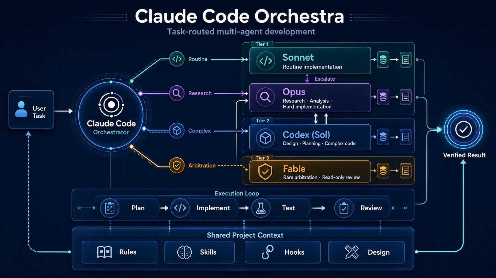

# claude-code-orchestra



Multi-Agent AI Development Environment

```
Claude Code (Orchestrator) ─┬─ Sonnet Subagents (Routine Implementation)
                             ├─ Opus Subagents (Research, Analysis, Difficult Implementation)
                             └─ Codex CLI (Planning & Complex Code)
```

## Quick Start

Confirm that both AI CLIs are installed and authenticated first:

```bash
claude --version && codex --version
```

### New Project

Create a repository with GitHub's **Use this template** button, clone it, then run:

```bash
claude
```

Run `/init` inside Claude Code to detect the project stack and populate the project
identity and design document.

### Existing Project

Run this from the root of an existing Git repository:

```bash
template_dir="$(mktemp -d)"
git clone --depth 1 https://github.com/DeL-TaiseiOzaki/claude-code-orchestra.git "$template_dir"
bash "$template_dir/scripts/install.sh" . && rm -rf "$template_dir"
```

The installer preserves project-owned files, including `README.md`, `VERSION`, and
existing `CLAUDE.md` content. Template-owned path conflicts stop the install before
changes are made. After reviewing the reported paths, `--force` can be used to back
them up under `.orchestra-backup-*/` and replace them.

An existing `.claude/settings.json` is never overwritten. When a manual merge is
needed, the installer writes `.claude/settings.orchestra.json`; merge the required
settings and delete the candidate before starting Claude Code.

Then start Claude Code and run `/init` inside it:

```bash
claude
```

## Prerequisites

### Claude Code

```bash
npm install -g @anthropic-ai/claude-code
claude login
```

### Codex CLI

```bash
npm install -g @openai/codex
codex login
```

### System Tools

The installer and updater require `git` and standard Unix shell tools. Template
updates additionally require `rsync`.

### Codex Plugin for Claude Code (Optional)

A plugin that lets you use Codex directly from Claude Code. Simplifies code review and task delegation.

```bash
# Run inside Claude Code
/plugin marketplace add openai/codex-plugin-cc
/plugin install codex@openai-codex
/reload-plugins
/codex:setup
```

**Available commands:**
- `/codex:review` — Code review
- `/codex:adversarial-review` — Design challenge review
- `/codex:rescue` — Task delegation
- `/codex:status` / `/codex:result` / `/codex:cancel` — Job management

### Keeping AI CLIs Up to Date

Claude Code and Codex CLI both release frequently — model names, flags, and sandbox semantics drift between minor versions. **Update both before each working session.**

```bash
# Claude Code (built-in self-update)
claude update

# Codex CLI
npm install -g @openai/codex@latest
```

Confirm versions afterward:

```bash
claude --version && codex --version
```

The Codex model is centralized in `.claude/settings.json` (`env.CODEX_MODEL`), which every `${CODEX_MODEL:-...}` reference resolves to. `.codex/config.toml` (`model` + `model_reasoning_effort = "xhigh"`) must be kept in sync — `.agents/check.sh` verifies coherence between the two. To always use the latest model, bump that single value (currently `gpt-5.6-sol`) — no need to edit individual skill files. The `${CODEX_MODEL:-...}` fallback is just a default for when the env var is unset. Note: `update.sh` never auto-merges `.claude/settings.json` — downstream users must bump `env.CODEX_MODEL` manually after reviewing the Phase 5 diff.

Claude subagent routing is explicit in `.claude/agents/`: `general-purpose-sonnet`
and `general-purpose-opus` pin their own model aliases in frontmatter. Unspecified
subagents default to Sonnet through `.claude/settings.json`
(`env.CLAUDE_CODE_SUBAGENT_MODEL`).

## Architecture

```
┌─────────────────────────────────────────────────────────────┐
│       Claude Code (Orchestrator — Opus, 1M context)         │
│       → Context conservation is top priority                │
│       → Handles user interaction, coordination, concise edits│
│                          │                                  │
│  ┌───────────────────────┼──────────────────────────────┐   │
│  │  Tier 1 — Default     │                              │   │
│  │  ┌────────────────────┴─────────────────────────┐    │   │
│  │  │ general-purpose-sonnet: routine impl.        │    │   │
│  │  │ general-purpose-opus: research / hard impl.  │    │   │
│  │  │ codex-debugger: error analysis               │    │   │
│  │  └──────────────────────────────────────────────┘    │   │
│  │                       │                              │   │
│  │  ┌────────────────────┴─────────────────────────┐    │   │
│  │  │ Tier 2 — Sol                                 │    │   │
│  │  │ Codex CLI  (gpt-5.6-sol, effort xhigh)      │    │   │
│  │  │ → Design, planning, complex code, debugging  │    │   │
│  │  └──────────────────────────────────────────────┘    │   │
│  │                       │                              │   │
│  │  ┌────────────────────┴─────────────────────────┐    │   │
│  │  │ Tier 3 — Fable  (rare advisor, read-only)    │    │   │
│  │  │ → Arbitration, stuck problems, final review  │    │   │
│  │  │ → Notes to .claude/docs/reviews/             │    │   │
│  │  └──────────────────────────────────────────────┘    │   │
│  └──────────────────────────────────────────────────────┘   │
└─────────────────────────────────────────────────────────────┘
```

### Context Management (Important)

To conserve the main orchestrator's (Opus, 1M context) context, large-scale tasks are delegated to the appropriate agents.

| Situation | Recommended Method |
|-----------|-------------------|
| Full codebase analysis | **Opus subagent** (1M context) |
| External research & surveys | **Opus subagent** (WebSearch/WebFetch) |
| Multimodal files (PDF/images) | Claude directly, or Opus subagent for large-scale analysis |
| Routine, well-scoped implementation | **general-purpose-sonnet** |
| Difficult implementation (ambiguous, cross-cutting, high-risk, repeatedly failing) | **general-purpose-opus**, with Codex as needed |
| Design & planning consultation | Subagent → Codex |
| Short questions & answers | Direct call OK |
| Detailed analysis needed | Via subagent → save to file |
| Design arbitration / stuck / large-change final review | **fable-advisor** (rare) |

## Directory Structure

`.claude/` = main orchestrator spec, `.agents/` = CLI subagent spec (tool-neutral), `.codex/` = Codex adapter.

```
.
├── CLAUDE.md                    # Orchestrator contract (lightweight; links to DESIGN.md & PROGRESS.md)
├── AGENTS.md                    # Thin pointer → .agents/AGENTS.md (for CLI subagent discovery)
├── README.md
├── PROGRESS.md                  # Generated by the first /checkpointing run; latest 5 summaries
├── LICENSE
├── pyproject.toml               # Python project configuration
├── uv.lock                      # Dependency lock file
├── VERSION                      # Version of this template repository; downstream projects may replace it
│
├── .agents/                     # CLI subagent spec (tool-neutral: Codex, Antigravity, Grok, ...)
│   ├── INDEX.md                 # Agent registry — lists all CLI subagents and their tiers
│   ├── tiers.md                 # Tier definitions (default / sol / fable)
│   ├── AGENTS.md                # Common contract + completion-verification guardrails
│   ├── check.sh                 # Coherence checker (model sync, tier consistency)
│   └── workflows/
│       └── antigravity/         # Experimental Antigravity adapter skeletons
│           ├── feature.md
│           └── troubleshoot.md
│
├── .claude/
│   ├── agents/
│   │   ├── general-purpose-sonnet.md # Routine, well-scoped implementation
│   │   ├── general-purpose-opus.md   # Research, analysis, difficult implementation, Codex delegation
│   │   ├── codex-debugger.md    # Error analysis agent (Opus)
│   │   └── fable-advisor.md     # Tier 3 rare advisor (Fable model, read-only)
│   │
│   ├── skills/                  # Reusable workflows (14 total)
│   │   ├── feature/             # Feature planning (existing/greenfield modes + complexity routing)
│   │   ├── team-execute/        # Parallel implementation + parallel review with Agent Teams
│   │   ├── spike/               # Technical investigation & feasibility study (decision document)
│   │   ├── plan/                # Implementation plan creation
│   │   ├── tdd/                 # Test-driven development
│   │   ├── simplify/            # Code refactoring
│   │   ├── codex-system/        # Codex CLI integration
│   │   ├── design-tracker/      # Detect & record design decisions into DESIGN.md
│   │   ├── research-lib/        # Library research
│   │   ├── update-lib-docs/     # Library documentation updates
│   │   ├── checkpointing/       # Session persistence + pattern discovery + compact phase
│   │   ├── catchup/             # Generate GUIDE.md for onboarding/re-onboarding
│   │   ├── init/                # Project initialization
│   │   └── troubleshoot/        # Error diagnosis & fix planning
│   │
│   ├── hooks/                   # Automation hooks (9 total)
│   │   ├── agent-router.py      # Agent routing
│   │   ├── lint-on-save.py      # Auto-lint on save
│   │   ├── post-bash-check.py   # Dispatcher: runs Bash-matcher checks in-process
│   │   └── ...
│   │
│   ├── rules/                   # Development guidelines
│   │   ├── coding-principles.md
│   │   ├── testing.md
│   │   └── ...
│   │
│   ├── settings.json             # Claude Code settings (hooks/permissions/env)
│   ├── orchestra-version         # Installed Orchestra version in downstream projects
│   │
│   ├── docs/
│   │   ├── DESIGN.md            # 要件定義書 (macro requirements & design)
│   │   ├── CODEX_HANDOFF_PLAYBOOK.md  # Codex delegation templates
│   │   ├── reviews/             # Fable advisor output (read-only review notes)
│   │   ├── research/            # Research results (Opus subagents)
│   │   └── libraries/           # Library constraints
│   │
│   └── logs/                    # Runtime generated (.gitignore target)
│       └── cli-tools.jsonl      # Codex I/O logs
│
├── .codex/                      # Codex adapter (model + approval config)
│   ├── AGENTS.md
│   ├── config.toml
│   └── skills/
│       ├── context-loader/      # Context loading skill
│       └── design-tracker/      # Design tracking skill
│
├── tests/
│   └── test_install_script.py  # Installer and updater integration tests
│
└── scripts/
    ├── install.sh              # Conflict-aware installer for existing projects
    └── update.sh               # Template update script
```

### Stabilizing Codex Integration

- Use templates from `@.claude/docs/CODEX_HANDOFF_PLAYBOOK.md` to standardize requests to Codex
- `.claude/rules/codex-delegation.md` defines the "Codex-first delegation" policy and exception conditions
- `.codex/config.toml` uses `approval_policy = "never"` to prevent blocking in non-interactive flows

## Workflow

The main workflow executes two skills in sequence.

```
/feature <feature>   Planning: mode determination → understanding → research & design → plan
    ↓ After user approval (COMPLEX route)
/team-execute        Phase 1: Parallel implementation → Phase 2: Parallel review (Agent Teams)
```

1. **Mode determination**: existing (Codex-direct design) or greenfield (Agent Teams research & design)
2. **Opus subagent** analyzes the codebase (1M context) + **Claude** conducts requirements gathering with the user
3. Existing mode: **Codex** designs, plans, and validates. Greenfield mode: **Agent Teams** — Researcher (Opus) and Architect (Codex) work in parallel
4. **Claude** integrates research and design, then presents the plan to the user
5. After approval, `/team-execute` runs parallel implementation by module, then parallel review for security, quality, and testing (`--review-only` skips implementation)

## Skills

### Core Workflow

#### `/feature` — Feature Planning & Implementation (unified)

One entry point for feature work, with two modes (merger of the old `/add-feature` and `/start-feature`).

```
/feature user profile editing feature
```

**Modes:**
- **existing** (formerly `/add-feature`) — Codex-first addition to an established codebase: Opus subagent + Codex scope & impact analysis, then Codex architecture design, implementation plan, and validation
- **greenfield** (formerly `/start-feature`) — large/new feature requiring external research: Opus subagent codebase analysis, then Agent Teams (Researcher [Opus] + Architect [Codex]) perform parallel research & design

**Shared complexity-based routing:**
- SIMPLE (1-3 files, <50 LOC) → Direct Codex implementation
- MODERATE (3-5 files) → Codex implementation + `/team-execute --review-only`
- COMPLEX (5+ files) → `/team-execute`

#### `/team-execute` — Parallel Implementation + Review (unified)

Two-phase Agent Teams execution (merger of the old `/team-implement` and `/team-review`). Executes based on the plan approved in `/feature`.

```
/team-execute                 # Phase 1 IMPLEMENT → Phase 2 REVIEW
/team-execute --review-only   # Skip Phase 1; review existing changes
```

**Phase 1 IMPLEMENT:**
- Launches Teammates per module/layer with separated file ownership
- Manages dependencies via shared task list for autonomous coordination
- Each Teammate records a work log to `.claude/logs/agent-teams/` upon completion

**Phase 2 REVIEW (reviewer composition):**
- **Security Reviewer** — Detects security vulnerabilities
- **Quality Reviewer** — Checks code quality & pattern compliance (leveraging Codex)
- **Test Reviewer** — Validates test coverage & quality

#### `/spike` — Technical Investigation & Feasibility Study

A Codex-first, time-boxed technical investigation. Produces a **decision document** (with go/no-go recommendation). Provides decision-making material, not an implementation plan.

```
/spike Should we adopt WebSocket or SSE?
```

**Workflow:**
1. **Claude + Codex** → Frame investigation questions & define constraints
2. **Agent Teams** → Researcher (Opus external research) and Feasibility Analyst (Codex deep analysis) investigate in parallel
3. **Codex** → Synthesize into go/no-go recommendation & produce research report

> After a GO decision, proceed to implementation with `/feature`

### Development

#### `/plan` — Implementation Plan

Breaks down requirements into concrete steps.

```
/plan Add API endpoint
```

**Output:**
- Implementation steps (files, changes, verification methods)
- Dependencies & risks
- Validation criteria

#### `/tdd` — Test-Driven Development

Implements using the Red-Green-Refactor cycle.

```
/tdd user registration feature
```

**Workflow:**
1. Design test cases
2. Write failing tests (Red)
3. Minimal implementation (Green)
4. Refactoring (Refactor)

#### `/simplify` — Code Refactoring

Simplifies code and improves readability.

#### `/troubleshoot` — Error Diagnosis & Fix Planning

Diagnoses errors and creates fix plans through multi-agent coordination centered on Codex.

```
/troubleshoot TypeError: cannot unpack non-iterable NoneType object
```

**Workflow:**
1. **Opus subagent + Codex** → Error reproduction & context collection
2. **Agent Teams** → Root Cause Analyst (Codex-driven) and Impact Investigator (Opus + Codex) diagnose in parallel
3. **Claude + Codex** → Fix plan integration & user approval

### Agent Delegation

#### `/codex-system` — Codex CLI Integration

Used for design decisions, debugging, and trade-off analysis.

**Trigger examples:**
- "How should this be designed?" "How should I implement this?"
- "Why isn't this working?" "I'm getting an error"
- "Which is better?" "Compare these options"

### Documentation

#### `/design-tracker` — Design Decision Tracking

Detects design decisions during conversation and structurally updates the relevant section of `.claude/docs/DESIGN.md` (機能要件 / 非機能要件 / アーキテクチャ / 技術選定 / 制約 / Key Decisions). Activates proactively and also on explicit requests ("record this", "update DESIGN").

#### `/research-lib` — Library Research

Investigates a library and generates comprehensive documentation in `.claude/docs/libraries/`.

```
/research-lib httpx
```

#### `/update-lib-docs` — Update Library Documentation

Updates existing documentation in `.claude/docs/libraries/` with the latest information.

### Session Management

#### `/checkpointing` — Session Persistence

Records all session activity (user requests, git history, CLI consultations, Agent Teams activity, design decisions) into a checkpoint whose top is a 5-section サマリ (何をしたのか / どういうやり取りをユーザーと行ったのか / どうやったのか / 途中でどういう課題が起こったのか / 将来のアクション). It then regenerates the rolling `PROGRESS.md` (latest 5 checkpoint summaries), reviews whether `.claude/docs/DESIGN.md` needs updating (invoking `/design-tracker` when warranted), and finishes with a built-in **Compact Phase** that prunes stale CLAUDE.md Zone C work blocks and compacts the conversation. It also discovers reusable skill patterns.

```bash
/checkpointing                    # Full recording + pattern discovery
/checkpointing --since "2026-02-08"  # Only since a specific date
/checkpointing --compact-only    # Run only the Compact Phase (old /context-refresh)
```

#### `/init` — Project Initialization

Analyzes the project structure, auto-detects tech stack, commands, and configuration. Populates `.claude/docs/DESIGN.md` (要件定義書 — macro requirements & design) and writes a thin pointer to DESIGN.md in CLAUDE.md Zone B. The root `AGENTS.md` remains a template-owned pointer to the canonical `.agents/` contract.

#### `/catchup` — Onboarding Guide

Scans the repository (git history, CLAUDE.md/AGENTS.md, project rules, skill catalog, DESIGN.md, research & library notes, checkpoints, agent-team logs) and writes a `GUIDE.md` at the repository root so new or returning contributors can understand past work and resume quickly.

```bash
/catchup
```

## Development

### Template Update

Safely applies template updates to your local project.

```bash
# Update to the latest version
./scripts/update.sh

# Update to a specific version
./scripts/update.sh v0.2.0

# Skip confirmation prompt
./scripts/update.sh --yes
```

When upgrading an installation that still uses an updater from v0.3.0 or earlier,
replace the updater itself before the first run. This prevents the old process from
writing its template version to a project-owned root `VERSION`:

```bash
template_dir="$(mktemp -d)"
git clone --depth 1 https://github.com/DeL-TaiseiOzaki/claude-code-orchestra.git "$template_dir"
cp "$template_dir/scripts/install.sh" "$template_dir/scripts/update.sh" scripts/
chmod +x scripts/install.sh scripts/update.sh
rm -rf "$template_dir"
./scripts/update.sh
```

**How it works:**
- `CLAUDE.md` uses a 3-zone layout separated by two markers:
  - **Zone A** (above `@orchestra:template-boundary`) — orchestra concept & template base; fully replaced by the update
  - **Zone B** (between the two markers) — repository identity, managed by `/init`; preserved across updates
  - **Zone C** (below `@orchestra:repo-boundary`) — working state (features, session notes); preserved across updates
- Projects still using the legacy `@orchestra:local-boundary` layout are auto-migrated on first run: their content below the legacy marker becomes Zone C, and Zone B is reset to the placeholder so `/init` can repopulate it
- skills/hooks/rules/agents (and `.agents/`, `.codex/`) are fully synced
- Local data such as `.claude/docs/research/` is preserved
- `.claude/settings.json` only shows a diff (manual merge required)
- The installed template version is stored in `.claude/orchestra-version`; a downstream project's root `VERSION` is never modified
- If the update modifies `scripts/update.sh` itself (e.g. a new version adds
  template directories such as `.agents/`), **run `./scripts/update.sh` a second
  time** — the first run still uses the old script's sync list. Newer scripts
  print a reminder when this applies (updating from v0.2.0 does not, so run
  twice when upgrading to v0.3.0)

### Tech Stack

| Tool | Purpose |
|--------|------|
| **uv** | Package management (pip is prohibited) |
| **ruff** | Linting & formatting |
| **ty** | Type checking |
| **pytest** | Testing |
| **poethepoet** | Task runner |

### Commands

```bash
# Dependencies
uv add <package>           # Add package
uv add --dev <package>     # Add dev dependency
uv sync                    # Sync dependencies

# Quality checks
poe lint                   # ruff check + format
poe typecheck              # ty
poe test                   # pytest
poe all                    # Run all checks

# Direct execution
uv run pytest -v
uv run ruff check .
```

## Hooks

Automation hooks execute agent coordination and quality checks at the appropriate timing.

| Hook | Trigger | Action |
|--------|----------|------|
| `agent-router.py` | User input | Suggests routing to Codex / Opus subagent |
| `lint-on-save.py` | File save | Auto-runs lint |
| `check-codex-before-write.py` | Before file write | Suggests consulting Codex |
| `check-codex-after-plan.py` | After Task execution | Suggests Codex review after planning/design tasks |
| `post-bash-check.py` | Any Bash tool call | Dispatcher: runs error detection, test-failure analysis, and Codex I/O logging in one process (deduped) |
| `error-to-codex.py` | Bash error detected | Suggests codex-debugger subagent (invoked in-process by `post-bash-check.py`) |
| `post-test-analysis.py` | Test/build failure | Suggests debug analysis via Codex (invoked in-process by `post-bash-check.py`) |
| `post-implementation-review.py` | After large implementation | Suggests code review via Codex |
| `log-cli-tools.py` | Codex execution | Records I/O logs (invoked in-process by `post-bash-check.py`; also runs standalone on `TaskCompleted`) |

## Language Rules

- **Code, thinking, and reasoning**: English
- **Responses to users**: Japanese
- **Technical documentation**: English
- **README, etc.**: Japanese permitted
